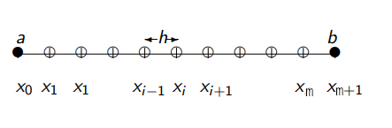

# 28) Midterm Solution

$$
-\frac{\partial^2 u}{\partial x^2} = f(x)
$$



on a 1D domain $[a,b] = [-1,1]$ discretized with $m+2$ equispaced grid points (but we're going to solve for the unknown only, i.e., for the $m$ interior grid points), with right-hand side forcing function $f(x) =\pi^2 \sin(\pi x)$, and (homogeneous) Dirichelet boundary conditions:

$$
u(a) = 0,  \quad u(b)=0 ,
$$

which has the exact solution $u(x)=\sin(\pi x)$.

I will outline here the process for generic, **non-homegenous** Dirichlet boundary conditions:

$$
u(a) = \alpha,  \quad u(b)= \beta ,
$$

and you can easily see how these apply for **homegenous** Dirichlet boundary conditions, when $\alpha = \beta = 0$.

For the interior grid points, for indices $i=1, \dots, m$, we have:

$$
\textrm{for } i=1: - u_0 + 2u_1 - u_2 = \Delta x^2 f_1
$$

We substitute the value given by the boundary condition: ${u_0} = \alpha$. Hence, the first equation to be solved becomes:

$$
\textrm{for } i=1:   2u_1 - u_2 = \Delta x^2 f_1 + \alpha
$$

For the last interior grid point, we have:

$$
\textrm{for } i=m: - u_{m-1} + 2u_m - u_{m+1} = \Delta x^2 f_m
$$

Again, we substitute the value given by the boundary condition: $u_{m+1} = \beta$. Hence, the last equation to be solved becomes:

$$
\textrm{for } i=m: - u_{m-1} + 2u_m  = \Delta x^2 f_m + \beta
$$


For **non-homegenous** Dirichlet boundary conditions:

$$
A =  \begin{bmatrix} 2 & -1 & 0 & & 0  \\ -1 & 2 & -1 & & \vdots  \\ 0 & -1 & 2 & & 0  \\ & & &  \ddots & -1 \\ 0 & \ldots & 0 & -1 & 2\end{bmatrix}_{m \times m}
\begin{bmatrix} u_1 \\ u_2 \\  \vdots \\  u_{m-1}\\ u_m
\end{bmatrix}_{m \times 1} =
\begin{bmatrix} {\Delta x^2}f(x_1) + \alpha \\ {\Delta x^2}f(x_2) \\  \vdots \\ {\Delta x^2} f(x_{m-1})\\ {\Delta x^2} f(x_m) +\beta
\end{bmatrix}_{m \times 1}
$$

For **homegenous** Dirichlet boundary conditions,with $\alpha = \beta = 0$:

$$
A =  \begin{bmatrix} 2 & -1 & 0 & & 0  \\ -1 & 2 & -1 & & \vdots  \\ 0 & -1 & 2 & & 0  \\ & & &  \ddots & -1 \\ 0 & \ldots & 0 & -1 & 2\end{bmatrix}_{m \times m}
\begin{bmatrix} u_1 \\ u_2 \\  \vdots \\  u_{m-1}\\ u_m
\end{bmatrix}_{m \times 1} =
\begin{bmatrix} {\Delta x^2}f(x_1) \\ {\Delta x^2}f(x_2) \\  \vdots \\ {\Delta x^2} f(x_{m-1})\\ {\Delta x^2} f(x_m)
\end{bmatrix}_{m \times 1}
$$

## Julia Implementation of Stationary Iterative Solvers: Jacobi, Gauss-Seidel and SOR

```{literalinclude} ../julia_programs/midterm/midterm.jl
:language: julia
:linenos: true
```


